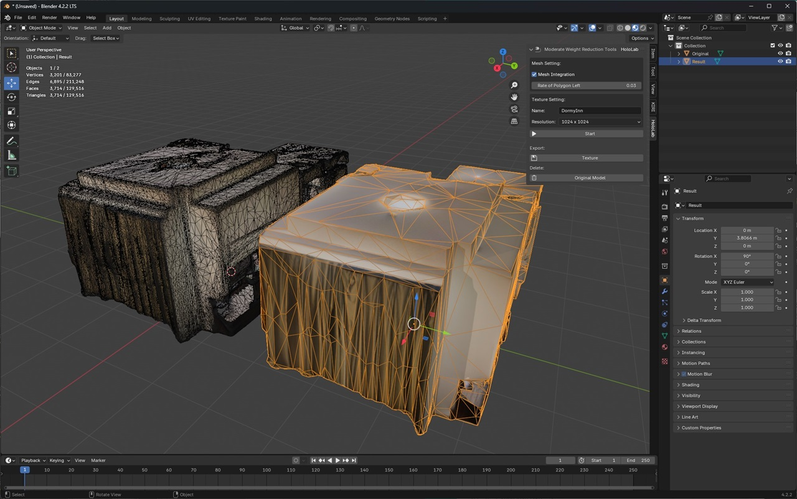

# Moderate Weight Reduction Tools

English | [Japanese](./README_JP.md)

## About

This blender add-on generates a model from the original model with reduced polygon mesh and optimized textures.  
If you need more details about how to use this blender add-on, Please refer to this [Video](https://www.youtube.com/@hololabinc) and [Article](https://blog.hololab.co.jp/).  

  

## How To Install

1. Open preferences by push [Edit] > [Preferences] button from the top menu.  
2. Open add-ons section by select [Add-ons] tab in the left column.
3. Open the file select dialog by push [Install from Disk] button from drop-down menu in top right.  
4. Select the add-on file "moderate_weight_reduction_tools.py" in the file selection dialog.  
5. If this add-on is not enabled, check the box next to "Moderate Weight Reduction Tools" in add-ons list.  

If you need more details, Please refer to this page about how to install add-on.  
https://docs.blender.org/manual/en/latest/editors/preferences/extensions.html

## How To Use

1. Select the model you want to reduction, and make a object active.  
2. Open [HoloLab] tab in side panel of 3D Viewport.  
3. Push [Start] button to output the model with reduced polygon mesh and optimized textures.  
4. (option) To export the model as FBX format, push [Texture] button of "Export:" section to save the texture file.  
5. (option) To export the model as USDZ format, push [Original Model] button of "Delete:" section to remove the unnecessary original model and tetextures from the project.  

## Settings

* Mesh Settigbs:  
    * Mesh Integration ... If the mesh is split, overlapping vertices are joined. (Default is not apply.)  
    * Rate of Polygon Left ... Ratio of polygon mesh left after reduction. (Default is 5%.)  
* Texture Settings:  
    * Name ... Name of new texture. (Default is "texture".)  
    * Resolution ... Resolution of new texture. (Default is 1024x1024.)  

## Support Versions

This add-on works with Blender 3.6, 4.0, 4.1, 4.2, and 4.3.  

## License

Copyright &copy; 2024 [HoloLab Inc.](https://hololab.co.jp/)  
This add-on is distributed under the MIT license.  

## Related Information

* [Blog@HoloLabInc](https://blog.hololab.co.jp/)  
* [YouTube@HoloLabInc](https://www.youtube.com/@hololabinc)  
