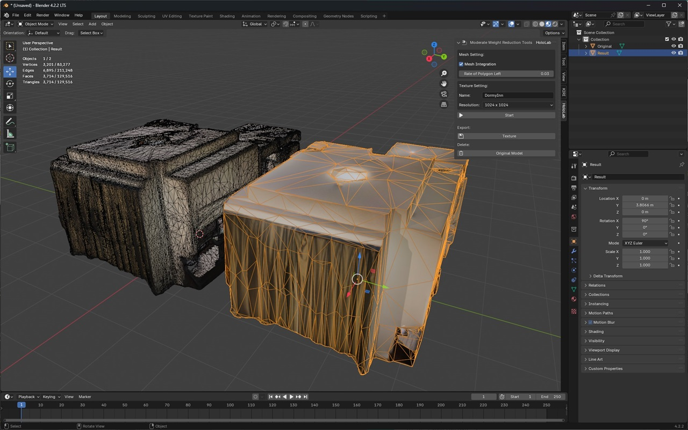

# Moderate Weight Reduction Tools

[English](./README.md) | Japanese

## 概要

このツールはポリゴン削減とテクスチャ最適化によりモデルを手軽に軽量化するBlenderアドオンです。  
詳細な使い方はこちらの[動画]()や[記事]()で解説していますのでご参照ください。  

  

## インストール方法

1. 上部メニューから[編集] > [プリファレンス]（[Edit] > [Preferences]）ボタンを押して設定画面を開きます。  
2. 左カラムから[アドオン]（[Add-ons]）タブを選択してアドオンの設定画面を開きます。  
3. 右上のドロップダウンから[ディスクからインストール]（[Install from Disk]）ボタンを押してファイル選択ダイアログを開きます。  
4. ファイル選択ダイアログでアドオンのファイル「moderate_weight_reduction_tools.py」を選択、[ディスクからインストール]（[Install from Disk]）ボタンを押してアドオンをインストールします。  
5. インストールされたアドオンが自動的に有効化されていない場合は、アドオンのリストから「Moderate Weight Reduction Tools」のチェックボックスにチェックを入れて有効化します。  

アドオンのインストール方法についての詳細は以下のドキュメントをご参照ください。  
https://docs.blender.org/manual/ja/latest/editors/preferences/extensions.html

## 使用方法

1. 軽量化したいモデルのオブジェクトを選択してアクティブ状態にします。  
2. 3Dビューのサイドパネルから[HoloLab]タブを開きます。  
3. パラメータを設定して[Start]ボタンを押すと、自動的にポリゴンの削減やテクスチャの最適化が実行されます。  
4. (オプション) モデルをFBXフォーマットで保存する場合、「Export:」セクションの[Texture]ボタンを押してテクスチャを保存してください。  
5. (オプション) モデルをUSDZフォーマットで保存する場合、「Delete:」セクションの[Original Model]ボタンを押して不要な元のモデルやテクスチャのオブジェクトを削除してください。  

## 設定

* Mesh Settigbs:  
    * Mesh Integration ... 大規模なポリゴン数のモデルや、スマホアプリで生成したスキャンモデルを処理する場合、重なり合った頂点の統合を適用します。（デフォルトは「無効」です。）  
    * Rate of Polygon Left ... 元のモデルのポリゴンからどれくらいまで削減するかの割合です。0.1なら1/10のポリゴン数になります。（デフォルトは「5%」です。）  
* Texture Settings:  
    * Name ... 最適化後のテクスチャの名前の指定します。（デフォルトは「texture」です。）  
    * Resolution ... 最適化後のテクスチャの解像度を指定します。（デフォルトは「1024x1024」です。）  

## サポートバージョン

このアドオンはBlender 3.6、4.0、4.1、および4.2で動作します。  

## ライセンス

Copyright &copy; 2024 [HoloLab Inc.](https://hololab.co.jp/)  
このアドオンはMITライセンスでライセンスされています。  